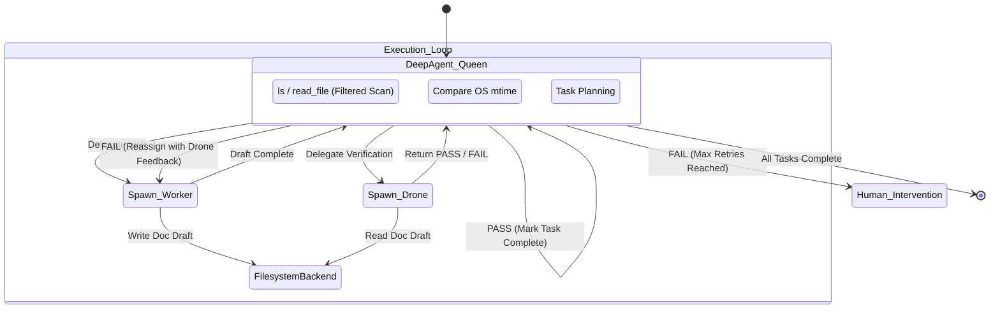

# AutoDoc Agent Swarm (DeepAgents Edition)

An advanced, hierarchical multi-agent system designed to autonomously analyze, template, generate, and verify documentation for any given code repository using [LangChain](https://github.com/langchain-ai/langchain) and [DeepAgents](https://github.com/deepagents/deepagents).

## Overview

The AutoDoc Agent Swarm minimizes boilerplate orchestration by leveraging the power of deepagents native toolset. It consists of three distinct agent roles that collaborate to ensure exceptionally high-quality technical documentation:

1. **Swarm Queen (Orchestrator)**: Uses native `deepagents` tools to deeply scan the codebase, evaluate documentation freshness, and delegate tasks. It strictly enforces retry loops and maintains a master "Todo" plan.
2. **Swarm Worker (Creator)**: A specialized technical writer subagent that parses source code and generates modular Markdown documentation, enriched with PlantUML diagrams and strict audit trails.
3. **Swarm Drone (Evaluator)**: A "devil's advocate" QA subagent. It critiques the Worker's output to ensure schema compliance, valid PlantUML syntax, and complete code coverage, returning structured feedback to the Queen.

## Features

- **Hierarchical Swarm Architecture**: Clear separation of concerns (Planning, Writing, Reviewing).
- **Multi-Provider LLM Support**: Configure the swarm to use OpenRouter, Anthropic, Google, or OpenAI out-of-the-box.
- **Per-Agent Model Configuration**: Assign distinct, optimized models for each agent (e.g. use a high-intelligence model for the Queen, and faster/cheaper models for the Worker and Drone).
- **Secure Filesystem Backend**: Implements a strict `SecureFilesystemBackend` preventing the LLM from inadvertently accessing or leaking sensitive data (`.env`, `.pem`, secrets, `.git`, `node_modules`).
- **Smart Incremental Updates**: Built-in freshness checks so the Swarm only documents files that have changed since the last run.
- **Mirrored Output Directory**: Output documentation elegantly mirrors the exact directory structure of the source code.

## Architecture Diagram



## Installation

This project uses `uv` for lightning-fast dependency management.

1. **Install `uv`** (if not already installed):
   Follow instructions at https://github.com/astral-sh/uv to install uv.

2. **Clone and Initialize**:
   ```bash
   git clone <your-repo-url>
   cd autodoc-swarm
   uv sync
   ```

3. **Configure Environment Variables**:
   Copy the example environment file and add your preferred API keys:
   ```bash
   cp .env.example .env
   ```
   *Edit `.env` to include your `OPENROUTER_API_KEY`, `ANTHROPIC_API_KEY`, etc. Optional LangSmith tracing configurations are also included.*

## Usage & Execution

A Typer CLI is provided for interacting with the swarm.

### Basic Execution

Run the swarm on a specific target directory:

```bash
uv run python run_swarm.py --target ./src
```

### Advanced Execution

Specify a different LLM provider and assign specific models to the Queen, Worker, and Drone agents:

```bash
uv run python run_swarm.py \
    --target ./my_backend_service \
    --provider openai \
    --queen-model gpt-4o \
    --worker-model gpt-4o-mini \
    --drone-model gpt-4o-mini
```

Force an update of all documentation, overriding the modification time freshness checks:

```bash
uv run python run_swarm.py --target ./src --force-update
```

## Development & Testing

To run the integration and unit test suite:

```bash
uv run pytest
```

Tests include validations for:
- The `SecureFilesystemBackend` successfully blocking access to `.env` files.
- The `check_file_freshness` logic accurately assessing modification timestamps.
- Successful initializations and distinct LLM assignments for the Queen and subagents.
- Documentation filesystem mirroring behavior.
