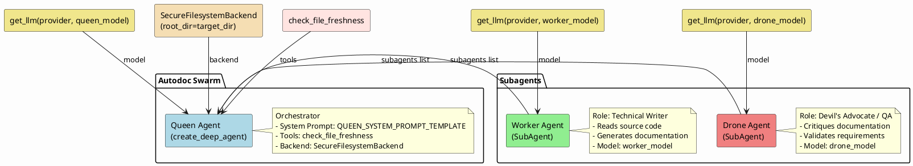

# Autodoc Swarm Agent

## Overview
The `agent.py` module is the core entry point for the autodoc-swarm system. It defines the `create_swarm` function, which constructs a hierarchical multi-agent architecture composed of three specialized subagents: a Queen (orchestrator), a Worker (technical writer), and a Drone (QA / devil's advocate). The Queen agent is equipped with a secure filesystem backend, a file-freshness checking tool, and access to both subagents, enabling it to coordinate the automated generation and validation of documentation from source code.

## Architecture Diagram


## Functions / Methods

### `create_swarm`

```python
def create_swarm(
    target_dir: str,
    provider: str,
    queen_model: str,
    worker_model: str,
    drone_model: str
)
```

Constructs and returns a fully configured Queen agent (via `create_deep_agent`) that orchestrates a documentation-generation swarm.

**Parameters:**

| Parameter      | Type   | Description                                                                                     |
|----------------|--------|-------------------------------------------------------------------------------------------------|
| `target_dir`   | `str`  | Root directory for the secure filesystem backend; also interpolated into the Queen system prompt.|
| `provider`     | `str`  | LLM provider name (e.g., `"openai"`, `"anthropic"`) passed to `get_llm`.                       |
| `queen_model`  | `str`  | Model identifier for the Queen orchestrator agent.                                              |
| `worker_model` | `str`  | Model identifier for the Worker (Technical Writer) subagent.                                    |
| `drone_model`  | `str`  | Model identifier for the Drone (Devil's Advocate / QA) subagent.                                |

**Returns:**

The configured Queen agent object returned by `create_deep_agent`.

**Behavior:**

1. **LLM Initialization** -- Calls `get_llm(provider, model)` three times to instantiate separate LLM instances for the Queen, Worker, and Drone.
2. **Backend Setup** -- Creates a `SecureFilesystemBackend` rooted at `target_dir` to provide sandboxed filesystem access.
3. **Prompt Preparation** -- Formats `QUEEN_SYSTEM_PROMPT_TEMPLATE` with `target_dir`.
4. **Subagent Creation** -- Instantiates two `SubAgent` objects:
   - **Worker** -- A Technical Writer subagent that reads source code and generates documentation using `WORKER_SYSTEM_PROMPT`.
   - **Drone** -- A QA / Devil's Advocate subagent that critiques generated documentation and validates requirements using `DRONE_SYSTEM_PROMPT`.
5. **Queen Assembly** -- Calls `create_deep_agent` with the Queen's system prompt, LLM, backend, the list of subagents (`[worker, drone]`), and the `check_file_freshness` tool, then returns the resulting agent.
